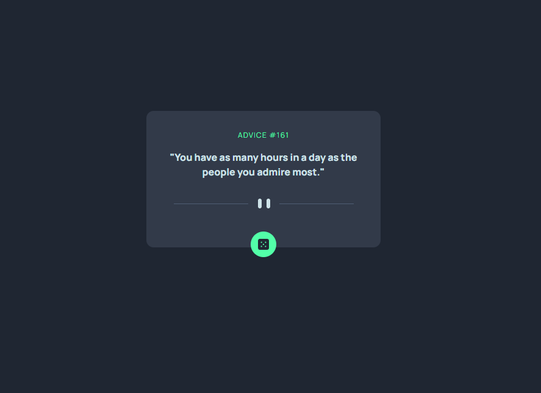

# Frontend Mentor - Advice generator app solution

This is a solution to the [Advice generator app challenge on Frontend Mentor](https://www.frontendmentor.io/challenges/advice-generator-app-QdUG-13db). Frontend Mentor challenges help you improve your coding skills by building realistic projects.

## Table of contents

- [Screenshot](#screenshot)
- [Built with](#built-with)
- [What I learned](#what-i-learned)
- [Author](#author)

### Screenshot

- Live Site URL: ()

### Built with

- Advice Slip API
- HTML & TailwindCSS
- JavaScript

### What I learned

- Fetch API to fetch data from the [Advice Slip Api](https://api.adviceslip.com/)
- Dynamically changing data in the DOM with JS
- `select-all` property in tailwindcss to select all text when user clicks on the text

## Author

- LinkedIn - [Muhammad Raza](https://www.linkedin.com/in/frontend-developer-muhammad-raza/)
- Frontend Mentor - [@illusiveCode](https://www.frontendmentor.io/profile/illusiveCode)

### Thanks for reading!
